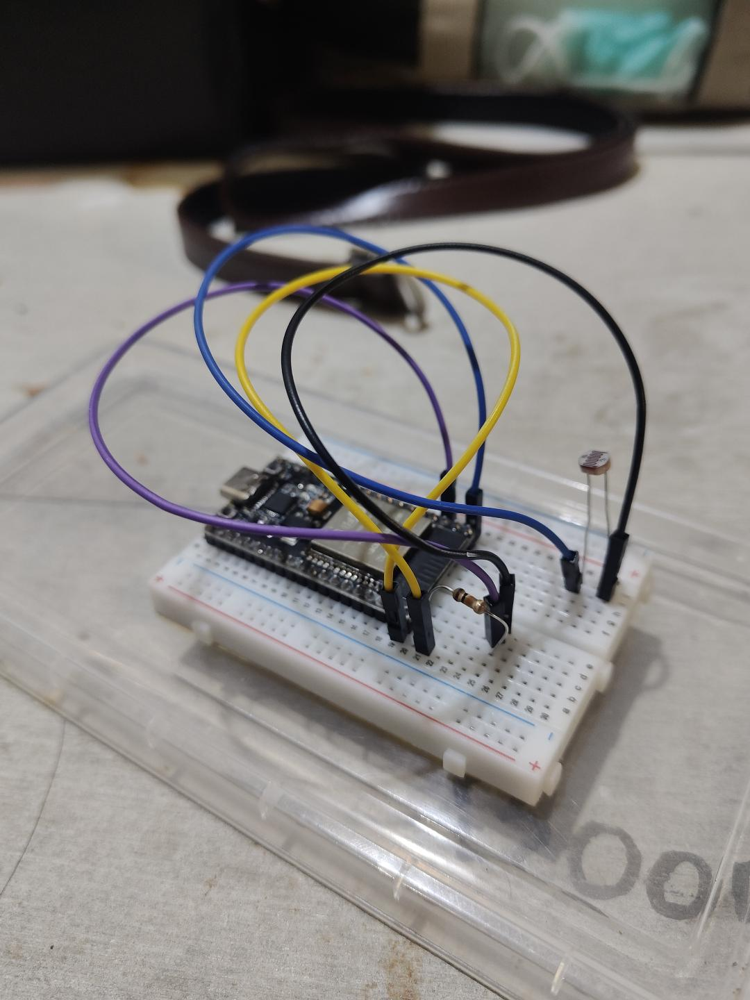

Homeworkweek 3

รูปต่อวงจรในใบงาน

**ส่วนที่ 5 — การทำกราฟ เพื่อหาสมการ**

## **ส่วนที่ 8 — คำถามท้ายใบงาน**

1. ทำไมต้องใช้ Voltage Divider ในการอ่าน LDR?
2. ทำไมต้องเก็บข้อมูลหลายจุดก่อนทำ Calibration?
3. ถ้า Noise มากกว่าสัญญาณจริง จะเกิดอะไรขึ้น?
4. ทำไมการวางตำแหน่งเซนเซอร์จึงสำคัญต่อ Signal Integrity?
5. ถ้า ADC มี Resolution ต่ำ จะส่งผลอย่างไรต่อความแม่นยำ?