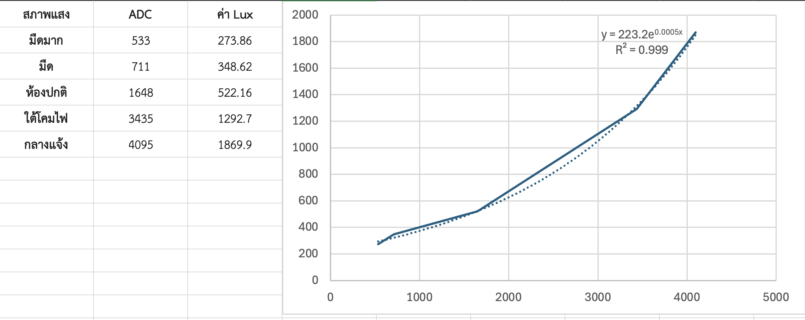

# **ใบงานปฏิบัติการ: การใช้งาน LDR และการทำ Calibration**


## **วัตถุประสงค์ของใบงาน**

1. เข้าใจหลักการทำงานของ LDR (Light Dependent Resistor)
2. ต่อวงจร Voltage Divider เพื่ออ่านค่าแสง
3. อ่านค่า ADC จากบอร์ดไมโครคอนโทรลเลอร์
4. เก็บข้อมูลจริง (ADC vs Lux จากมือถือ)
5. ทำกราฟความสัมพันธ์
6. สร้างสมการ Calibration เพื่อแปลง ADC → Lux
7. ทดสอบความแม่นยำหลัง Calibration

# **ส่วนที่ 1 — ความรู้พื้นฐาน**

## **1.1 LDR คืออะไร**


LDR (Light Dependent Resistor) หรือ Photoresistor คืออุปกรณ์อิเล็กทรอนิกส์ชนิดหนึ่งที่มี **ค่าความต้านทานเปลี่ยนตามความเข้มของแสง** ที่ตกกระทบ

- **แสงมาก → ความต้านทานลดลง**
- **แสงน้อย → ความต้านทานเพิ่มขึ้น**

LDR จึงเหมาะสำหรับงานตรวจจับความสว่าง เช่น ระบบเปิดไฟอัตโนมัติ, ระบบวัดแสง, ระบบควบคุมหน้าจอ, ระบบความปลอดภัย ฯลฯ


## **1.2 โครงสร้างและหลักการทำงานภายใน**

LDR ทำจากสารกึ่งตัวนำ เช่น **Cadmium Sulfide (CdS)** หรือ **Cadmium Selenide (CdSe)**
### เมื่อมีแสงตกกระทบ:
1. โฟตอนของแสงกระตุ้นอิเล็กตรอนในสารกึ่งตัวนำ
2. อิเล็กตรอนหลุดจากแถบวาเลนซ์ไปยังแถบคอนดักชัน
3. จำนวนผู้พาไฟฟ้าเพิ่มขึ้น
4. ความต้านทานลดลง

### เมื่อไม่มีแสง:

- อิเล็กตรอนกลับสู่สภาวะปกติ
- ผู้พาไฟฟ้าลดลง
- ความต้านทานเพิ่มขึ้นมาก (อาจถึงหลายร้อย kΩ)

##  **1.3 พฤติกรรมเชิงคณิตศาสตร์ (Transfer Function)**

ความสัมพันธ์ระหว่าง **ความต้านทานของ LDR (R_LDR)** กับ **ความเข้มแสง (Lux)** ไม่เป็นเส้นตรง แต่เป็นแบบ **Exponential / Power Law**

### **สมการทั่วไปของ LDR**


$$R_{LDR}=A⋅(Lux)^{−α}
$$

โดย
	
	$A$ = ค่าคงที่ขึ้นกับรุ่นของ LDR

	$α$ = ค่าคงที่ (ประมาณ 0.7–0.9)
	
	$Lux$ = ความเข้มแสง

ความหมายคือ:
- เมื่อ Lux เพิ่มขึ้น → R ลดลงแบบโค้ง
- ไม่ใช่ความสัมพันธ์เชิงเส้น

เพื่ออ่านค่า LDR ต้องใช้วงจร **Voltage Divider** เพื่อแปลงความต้านทาน → แรงดัน → ADC อ่านได้

##  **1.4 ทำไมต้องใช้ Voltage Divider**

LDR ให้ “ความต้านทาน” แต่ไมโครคอนโทรลเลอร์อ่าน “แรงดัน” ดังนั้นต้องใช้วงจร **Voltage Divider** เพื่อแปลง R → V

### วงจร Voltage Divider


 **สมการแรงดันที่อ่านได้**


$$V_{out}=V_{cc}⋅\frac{R_{fixed}}{R_{LDR}+R_{fixed}}
$$

เมื่อ:

- $R_{LDR}$ ลดลง (แสงมาก) → $V_{out}$ เพิ่มขึ้น

- $R_{LDR}$ เพิ่มขึ้น (แสงน้อย) → $V_{out}$ ลดลง

## **1.5 ช่วงค่าความต้านทานของ LDR**

ค่าทั่วไปของ LDR

| สภาพแสง  | ความต้านทาน   |
| -------- | ------------- |
| มืดสนิท  | 200 kΩ – 2 MΩ |
| ห้องปกติ | 10 kΩ – 50 kΩ |
| ใต้โคมไฟ | 2 kΩ – 10 kΩ  |
| กลางแจ้ง | 200 Ω – 2 kΩ  |

## **1.6 คำนวณแรงดันเอาต์พุตจากวงจร**

| สภาพแสง  | ความต้านทาน   | แรงดันเอาต์พุต (โวลต์) |
| -------- | ------------- | ---------------------- |
| มืดสนิท  | 200 kΩ – 2 MΩ | 0.016 – 0.157          |
| ห้องปกติ | 10 kΩ – 50 kΩ | 0.55 – 1.65            |
| ใต้โคมไฟ | 2 kΩ – 10 kΩ  | 1.65 – 2.75            |
| กลางแจ้ง | 200 Ω – 2 kΩ  | 2.75 – 3.23            |


---
# **ส่วนที่ 2 — การต่อวงจร**

## **อุปกรณ์ที่ใช้**

- LDR
- R คงที่ 10 kΩ
- บอร์ด ESP32 / Arduino
- สาย Jumper
- แอปวัดแสงในมือถือ (Lux Meter)

## **วงจร Voltage Divider**


**เหตุผลที่ใช้ R 10kΩ:** เป็นค่าที่เหมาะสมสำหรับ LDR ทั่วไป ทำให้แรงดันอยู่ในช่วงที่ ADC อ่านได้ดี

## **ส่วนที่ 3 — การอ่านค่า ADC**

ตัวอย่างโค้ด ESP32 (ADC 12-bit)

```c
#include <stdio.h>
#include "driver/adc.h"
#include "esp_adc_cal.h"
#include "esp_log.h"

#define ADC_CHANNEL     ADC1_CHANNEL_6   // GPIO34
#define ADC_ATTEN       ADC_ATTEN_DB_11  // รองรับ ~3.3V
#define ADC_WIDTH       ADC_WIDTH_BIT_12 // 0–4095

static esp_adc_cal_characteristics_t adc_chars;

void app_main(void)
{
    // 1) ตั้งค่า ADC
    adc1_config_width(ADC_WIDTH);
    adc1_config_channel_atten(ADC_CHANNEL, ADC_ATTEN);

    // 2) ทำ Calibration (ใช้ค่า Vref = 1100mV)
    esp_adc_cal_characterize(
        ADC_UNIT_1,
        ADC_ATTEN,
        ADC_WIDTH,
        1100,              // ค่า Vref ของ ESP32 โดยประมาณ
        &adc_chars
    );

    while (1) {
        // 3) อ่านค่า ADC raw
        int raw = adc1_get_raw(ADC_CHANNEL);
        // 4) แปลงเป็นแรงดัน (mV)
        uint32_t voltage = esp_adc_cal_raw_to_voltage(raw, &adc_chars);
        printf("ADC Raw = %d, Voltage = %d mV\n", raw, voltage);
        vTaskDelay(pdMS_TO_TICKS(500));
    }
}
```

ค่าที่อ่านได้ (12 bit) จะอยู่ในช่วง **0–4095** 

## **ส่วนที่ 4 — การเก็บข้อมูลเพื่อทำ Calibration**

ให้นักศึกษาทำ 5–7 จุดวัด โดยใช้มือถือวัดค่า Lux เทียบกับ LDR โดยเปลี่ยนสภาพแสง ให้มีความแตกต่างกัน

**ผลการวัดข้อมูลจริงเพื่อทำ Calibration**

| สภาพแสง  | ค่า ADC | ค่า Lux (มือถือ) |
| -------- | ------- | ---------------- |
| มืดมาก   | 533     | 273.86           |
| มืด      | 711     | 348.62           |
| ห้องปกติ | 1648    | 522.16           |
| ใต้โคมไฟ | 3435    | 1292.7           |
| กลางแจ้ง | 4095    | 1869.9           |

**รูปตารางผลลัพธ์ที่ได้**



**เป้าหมาย:** สร้างกราฟ ADC → Lux เพื่อหาความสัมพันธ์

## **ส่วนที่ 5 — การทำกราฟ เพื่อหาสมการ**

ให้นักศึกษาใช้ Excel / Google Sheet
1. ใส่ข้อมูล ADC และ Lux
2. สร้างกราฟ Scatter
3. ใส่ Trendline
4. เลือก Linear หรือ Polynomial
5. ให้โปรแกรมแสดงสมการ

**ขั้นตอนการหาสมการ**
1. นำข้อมูลป้อนเข้าสู่ excel หรือ google sheet


2. เลือกข้อมูลเพื่อทำกราฟ scatter


3. แทรกกราฟ scatter


4. คลิกขวาที่เส้นกราฟ เลือก เพิ่มเส้นแนวโน้ม


5. ติ๊กที่ตัวเลือก 

	✅ แสดงสมการบนแผนภูมิ 

	✅ แสดงค่า R-squared บนแผนภูมิ

6. เลือกชนิดของกราฟ ที่ทำให้เส้นแนวโน้มทับเส้นข้อมูลมากที่สุด

	สังเกตุจากค่า R-squared ต้องเท่ากับ 1.000 หรือใกล้เคียงมากที่สุด

7. คัดลอกสมการ $y = ...$ ไปใช้ในโปรแกรม


สมมติว่า trend line ได้สมการเป็น $y = 0.42x-50$

แสดงว่ามีความชันของเส้นกราฟเป็น $m=0.42$ และมีจุดตัดแกน $y$  ที่ $b = -50$ ให้เขียน code แบบนี้

```c
Lux = 0.42 × ADC – 50
```

หรือถ้ากราฟไม่เป็นเส้นตรง  ให้ใช้ Polynomial เช่น สมมติว่าได้สมการเป็น $y = 0.0001 × x^2 + 0.3 x – 40$ ให้เขียน code แบบนี้

```c
Lux = 0.0001 × ADC^2 + 0.3 × ADC – 40
```

## **ส่วนที่ 6 — การทำ Calibration ในโค้ด**

ตัวอย่างแบบ Linear Fit

```c
float lux = 0.42 * raw - 50;
```

ตัวอย่างแบบ Polynomial:

```c
float lux = 0.0001 * raw * raw + 0.3 * raw - 40;
```

**หมายเหตุ** 

Code ที่ใช้ สามารถ reuse code  จากการ calibrate ค่ามุมในการทดลองที่แล้วได้


## **ส่วนที่ 7 — การทดสอบผลลัพธ์**

ให้นักศึกษาทดสอบ 3 จุดแสงใหม่ที่ไม่ได้ใช้ตอนเก็บข้อมูล เช่น:

| สภาพแสงใหม่ | ADC  | Lux มือถือ | Lux จากโค้ด |
| ----------- | ---- | ---------- | ----------- |
| ใต้โต๊ะ     | 600  | 40         | 38          |
| ห้องเรียน   | 1500 | 180        | 175         |
| หน้าต่าง    | 2800 | 500        | 520         |

**ผลการวิเคราะห์:**

ความคลาดเคลื่อนจากการทดสอบอยู่ในระดับที่ยอมรับได้ เนื่องจากการแปลงค่าด้วยสมการมีค่าใกล้เคียงกับค่าความเข้มแสงจริงที่วัดได้จากแอปพลิเคชันมือถือ โดยมีเปอร์เซ็นต์ความผิดพลาดที่ต่ำสำหรับการใช้งานทั่วไป นอกจากนี้สมการแบบ Polynomial มีความเหมาะสมมากกว่าสมการแบบ Linear เนื่องจากความสัมพันธ์ระหว่างค่าความต้านทานของ LDR และความเข้มแสงมีพฤติกรรมเป็นเส้นโค้งแบบเอกซ์โพเนนเชียล การใช้สมการเส้นโค้งจึงสามารถปรับความสอดคล้องกับจุดข้อมูลได้ดีกว่าการใช้เส้นตรง

## **ส่วนที่ 8 — คำถามท้ายใบงาน**

1. ทำไมต้องใช้ Voltage Divider ในการอ่าน LDR?
ตอบ: ไมโครคอนโทรลเลอร์ไม่สามารถอ่านค่าความต้านทานได้โดยตรงแต่อ่านค่าแรงดันไฟฟ้าได้ การใช้วงจร Voltage Divider จึงเป็นวิธีแปลงค่าความต้านทานที่เปลี่ยนไปของ LDR ให้กลายเป็นระดับแรงดันไฟฟ้าที่ ADC สามารถรับและแปลงเป็นค่าดิจิทัลได้

2. ทำไมต้องเก็บข้อมูลหลายจุดก่อนทำ Calibration?
ตอบ: ความสัมพันธ์ระหว่างความต้านทานของ LDR และความเข้มแสงไม่ใช่เชิงเส้นตรง การเก็บข้อมูลในสภาพแสงที่แตกต่างกันหลายๆ จุดจะช่วยให้สามารถสร้างสมการหรือกราฟที่ครอบคลุมช่วงการทำงานจริงได้ดีขึ้นและลดความคลาดเคลื่อนในการแปลงค่า

3. ถ้า Noise มากกว่าสัญญาณจริง จะเกิดอะไรขึ้น?
ตอบ: หากสัญญาณรบกวนมีขนาดใหญ่กว่าสัญญาณจริงจะทำให้ค่าที่อ่านได้จาก ADC มีความผันผวนสูงมาก ส่งผลให้ระบบประมวลผลผิดพลาดและไม่สามารถแยกแยะสภาพแสงที่แท้จริงได้ ซึ่งอาจทำให้การควบคุมอุปกรณ์เช่นการเปิดปิดหลอดไฟทำงานผิดปกติ

4. ทำไมการวางตำแหน่งเซนเซอร์จึงสำคัญต่อ Signal Integrity?
ตอบ: การวางเซนเซอร์และสายสัญญาณในตำแหน่งที่เหมาะสมช่วยลดโอกาสการรับสัญญาณรบกวนจากภายนอก เช่น คลื่นแม่เหล็กไฟฟ้าจากอุปกรณ์อื่นหรือสัญญาณรบกวนจากแหล่งจ่ายไฟ ซึ่งจะทำให้แรงดันที่ส่งไปยัง ADC มีความเสถียรและแม่นยำมากยิ่งขึ้น

5. ถ้า ADC มี Resolution ต่ำ จะส่งผลอย่างไรต่อความแม่นยำ?
ตอบ: ค่าความละเอียดของ ADC ที่ต่ำจะทำให้ความสามารถในการแยกแยะความแตกต่างของแรงดันไฟฟ้าน้อยลง ส่งผลให้การอ่านค่าแสงที่เปลี่ยนแปลงเพียงเล็กน้อยไม่สามารถตรวจจับได้ ทำให้การแปลงค่าความเข้มแสงขาดความละเอียดและเกิดความคลาดเคลื่อนสูงขึ้น

## **ส่วนที่ 9 — ผลลัพธ์ที่คาดหวัง**

ผู้เรียนจะสามารถ:
- ต่อวงจร LDR ได้อย่างถูกต้อง
- อ่านค่า ADC ได้
- เก็บข้อมูลจริงและสร้างกราฟความสัมพันธ์
- ทำ Calibration เพื่อแปลง ADC → Lux
- ประเมินความแม่นยำของระบบวัดแสงที่สร้างขึ้นเอง

## **ส่วนที่ 10 —  Rubric ประเมินตนเอง**

### **ส่วนที่ 10.1 — ความเข้าใจพื้นฐาน LDR (20 คะแนน)**

| ข้อ | รายการ                                                         | คะแนน<br>(0–5 คะแนน) | เหตุผล |
| --- | -------------------------------------------------------------- | -------------------- | ------ |
| 1.1 | อธิบายหลักการทำงานของ LDR ได้ถูกต้อง                           | 5 | สามารถอธิบายความสัมพันธ์ระหว่างแสงกับความต้านทานได้อย่างชัดเจน |
| 1.2 | อธิบายการทำงานภายใน LDR (โฟตอน → อิเล็กตรอน → conduction band) | 5 | เข้าใจการทำงานในระดับอิเล็กตรอนและการนำไฟฟ้าของวัสดุกึ่งตัวนำ |
| 1.3 | เข้าใจว่าความสัมพันธ์ R vs Lux ไม่เป็นเส้นตรง                  | 5 | รับทราบถึงพฤติกรรมแบบเอกซ์โพเนนเชียลและไม่ได้เปลี่ยนแปลงเป็นเชิงเส้น |
| 1.4 | เข้าใจเหตุผลที่ต้องใช้ Voltage Divider                         | 5 | ทราบว่าไมโครคอนโทรลเลอร์รับข้อมูลเป็นแรงดันจึงต้องแปลงความต้านทานเป็นแรงดันก่อน |

### **ส่วนที่ 10.2 — การต่อวงจรและอ่านค่า ADC (20 คะแนน)**

| ข้อ | รายการ                              | คะแนน<br>(0–5 คะแนน) | เหตุผล |
| --- | ----------------------------------- | -------------------- | ------ |
| 2.1 | ต่อวงจร Voltage Divider ได้ถูกต้อง  | 5 | สามารถต่อวงจรโดยใช้สายจัมเปอร์และตัวต้านทานตามแบบได้อย่างสมบูรณ์ |
| 2.2 | เลือกค่า R คงที่เหมาะสม (เช่น 10kΩ) | 5 | เข้าใจเหตุผลที่เลือกใช้ตัวต้านทาน 10kΩ ว่าเหมาะสมกับช่วงความต้านทานของ LDR |
| 2.3 | เขียนโปรแกรมอ่านค่า ADC ได้ถูกต้อง  | 5 | เขียนโค้ดอ่านค่าได้อย่างถูกต้องและมีฟังก์ชันการคำนวณครบถ้วน |
| 2.4 | ใช้ ESP‑IDF ADC + Calibration ได้   | 5 | เข้าใจการปรับเทียบค่าและใช้งานไลบรารีของระบบเพื่อให้ได้ข้อมูลดิบที่เสถียร |

### **ส่วนที่ 10.3 — การเก็บข้อมูลจริง (20 คะแนน)**

| ข้อ | รายการ                             | คะแนน<br>(0–5 คะแนน) | เหตุผล |
| --- | ---------------------------------- | -------------------- | ------ |
| 3.1 | เก็บข้อมูล ADC อย่างน้อย 5–7 จุด   | 5 | บันทึกข้อมูลและจัดสภาพแสงได้อย่างน้อยห้าจุดตามเงื่อนไขที่กำหนด |
| 3.2 | วัดค่า Lux จากมือถือได้ถูกต้อง     | 5 | ใช้งานแอปพลิเคชันวัดแสงเพื่อนำตัวเลขมาเปรียบเทียบได้อย่างถูกต้อง |
| 3.3 | จดข้อมูลเป็นตารางครบถ้วน           | 5 | บันทึกข้อมูลทั้งสภาพแสงค่าความเข้มแสงและค่าจากเซนเซอร์ได้อย่างเป็นระเบียบ |
| 3.4 | ควบคุมสภาพแสงให้คงที่ระหว่างการวัด | 5 | สามารถป้องกันแสงสอดแทรกจากภายนอกขณะอ่านค่าและบันทึกข้อมูลได้ดี |


### **ส่วนที่ 10.4 — การทำกราฟและสร้างสมการ Calibration (25 คะแนน)**

| ข้อ | รายการ                                        | คะแนน<br>(0–5 คะแนน) | เหตุผล |
| --- | --------------------------------------------- | -------------------- | ------ |
| 4.1 | สร้างกราฟ Scatter ADC vs Lux ได้              | 5 | นำข้อมูลมาพล็อตกราฟจุดได้ตรงตามขั้นตอนการใช้โปรแกรมตารางคำนวณ |
| 4.2 | เลือก Trendline เหมาะสม (Linear / Polynomial) | 5 | สามารถเลือกเส้นแนวโน้มที่ครอบคลุมจุดข้อมูลต่างๆ ได้อย่างเหมาะสมที่สุด |
| 4.3 | อ่านสมการจากกราฟได้ถูกต้อง                    | 5 | สามารถนำค่าคงที่จากสมการที่โปรแกรมสร้างขึ้นมาใช้งานได้โดยไม่ผิดพลาด |
| 4.4 | นำสมการไปใช้ในโค้ดได้                         | 5 | ดัดแปลงโปรแกรมโดยแทรกสมการคณิตศาสตร์เพื่อแปลงค่าที่อ่านได้สำเร็จ |
| 4.5 | วิเคราะห์ว่า Linear หรือ Polynomial เหมาะกว่า | 5 | เปรียบเทียบความสัมพันธ์และให้เหตุผลว่ากราฟชนิดใดมีความแม่นยำกว่ากันได้ |
### **ส่วนที่ 10.5 — การทดสอบผลลัพธ์และวิเคราะห์ (15 คะแนน)**

| ข้อ | รายการ                                   | คะแนน<br>(0–5 คะแนน) | เหตุผล |
| --- | ---------------------------------------- | -------------------- | ------ |
| 5.1 | ทดสอบจุดแสงใหม่ที่ไม่ได้ใช้ตอนเก็บข้อมูล | 5 | นำสมการไปทดสอบกับสภาพแสงนอกตารางทดลองเพื่อพิสูจน์ผลลัพธ์ได้อย่างดี |
| 5.2 | เปรียบเทียบ Lux มือถือ vs Lux จากโค้ด    | 5 | เปรียบเทียบความแตกต่างเพื่อหาค่าความผิดพลาดได้ถูกต้อง |
| 5.3 | วิเคราะห์ความคลาดเคลื่อนและสาเหตุได้     | 5 | สรุปผลและหาเหตุผลถึงตัวแปรหรือสาเหตุที่อาจทำให้ข้อมูลมีความคลาดเคลื่อนได้ |

###  **คะแนนรวมทั้งหมด:** `100 / 100`

###  **คำถามสะท้อนความเข้าใจ (Reflection)**

ให้นักศึกษาเขียนตอบสั้น ๆ

1. จุดไหนในใบงานที่คิดว่ายากที่สุด?
ตอบ: การหาสมการจากกราฟที่มีความสัมพันธ์แบบไม่เป็นเส้นตรงมีความท้าทายมากที่สุด เนื่องจากการเลือกฟังก์ชันและตัวแปรต้องอาศัยความเข้าใจทางคณิตศาสตร์และการพิจารณาค่าความคลาดเคลื่อนให้เหมาะสมที่สุด

2. ถ้าทำใบงานนี้อีกครั้ง จะปรับปรุงอะไร?
ตอบ: จะเพิ่มจำนวนจุดเก็บข้อมูลให้ละเอียดมากยิ่งขึ้นในแต่ละช่วงความสว่างเพื่อนำมาสร้างสมการที่มีความถูกต้องแม่นยำยิ่งกว่าเดิม และจะป้องกันแสงสว่างจากภายนอกไม่ให้รบกวนขณะทำการเก็บค่า

3. ส่วนไหนที่คิดว่าตนเองเข้าใจดีมาก?
ตอบ: เข้าใจหลักการทำงานของวงจร Voltage Divider และวิธีการแปลงค่าแรงดันไฟฟ้าที่อ่านได้จาก ADC ให้กลายเป็นค่าความต้านทานและความเข้มแสงได้อย่างชัดเจน

